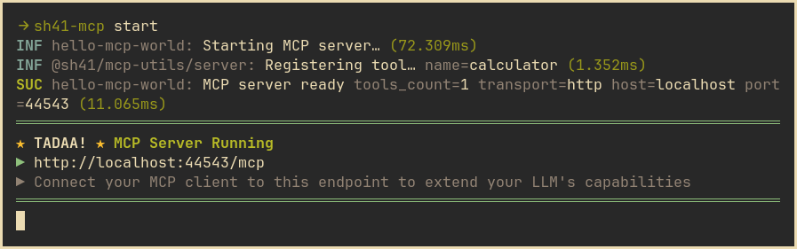

[](https://github.com/shell41/mcp-utils/actions/workflows/release.yml)
[](https://www.npmjs.com/package/@sh41/mcp-utils)

# @sh41/mcp-utils

> Reusable MCP server primitives and utilities for building [Model Context
> Protocol][intro_mcp-ts-sdk] servers with TypeScript.

- TypeScript first development with built-in type safety
- 󰍉 Easy debugging with [MCP Inspector][intro_mcp-inspector]

[intro_mcp-ts-sdk]: https://github.com/modelcontextprotocol/typescript-sdk
[intro_mcp-inspector]: https://github.com/modelcontextprotocol/inspector



## Installation

```sh
npm install @sh41/mcp-tools @modelcontextprotocol/sdk@^1.18 zod@^3.23
```

Peer dependencies `@modelcontextprotocol/sdk^1.18` and `zod^3.23` must be
installed as well.

> [!INFO]
>
> `zod` is intentionaly downgraded from `^4`, see [`DECISIONS.md`](DECISIONS.md)
> for more details.

## Usage

### HTTP Server

```typescript
// index.ts
import { buildMCPServer } from "@sh41/mcp-utils"
import { buildLogger } from "@asd14/node-utils/logger"
import { calculatorTool } from "./tools/calculator.js"

const logger = buildLogger({ namespace: "hello-mcp-world", level: "info" })

// Create server instance
const server = buildMCPServer({
  name: "hello-mcp-world",
  version: "1.0.0",
  tools: [calculatorTool],
  transport: "http"
})

// Set up event handlers
server.events.on("serverStarting", () => {
  logger.info("Starting MCP server…")
})

server.events.on("serverReady", (connectionInfo, registeredTools) => {
  logger.success("MCP server ready", {
    tools: registeredTools.map(tool => tool.name),
    ...connectionInfo
  })

  if (connectionInfo.transport === "http") {
    logger.tadaa({
      title: "MCP Server Running",
      message: `http://${connectionInfo.host}:${connectionInfo.port}/mcp`,
      note: "Connect your MCP client to this endpoint to extend your LLM's capabilities"
    })
  }
})

// Start server
await server.start()

// Graceful shutdown
const shutdown = async () => {
  logger.info("Shutting down gracefully...")
  await server.stop()
  process.exit(0)
}

process.on("SIGTERM", () => {
  void shutdown()
})
```

### Custom Tool Definition

```typescript
// tools/calculator.ts
import type { Tool, ToolHandler } from "@sh41/mcp-utils"
import { z } from "zod"

/**
 * Schema defining the input parameters for calculator operations
 */
const inputSchema = {
  operation: z
    .enum(["add", "subtract", "multiply", "divide"] as const)
    .describe("Operation to perform"),
  a: z.number().describe("First number"),
  b: z.number().describe("Second number")
}

/**
 * Schema defining the output format of calculator operations
 */
const outputSchema = {
  operation: z.string().describe("Operation performed"),
  parameters: z
    .array(z.number())
    .describe("Parameters used in the calculation"),
  result: z.string().describe("Result of the calculation")
}

/**
 * Implements the arithmetic operations supported by the calculator
 */
const capabilities = {
  add: (a: number, b: number) => a + b,
  subtract: (a: number, b: number) => a - b,
  multiply: (a: number, b: number) => a * b,
  divide: (a: number, b: number) => {
    if (b === 0) throw new Error("Division by zero is not allowed")
    return a / b
  }
} as const

/**
 * Calculator handler implementation
 */
const handler: ToolHandler<typeof inputSchema> = ({ operation, a, b }) => {
  try {
    const result = String(capabilities[operation](a, b))

    return {
      structuredContent: {
        operation,
        parameters: [a, b],
        result: result
      },
      content: [
        {
          type: "text",
          text: `Successfully performed '${operation}' operation on '${a}' and '${b}'`
        },
        {
          type: "text",
          text: `The result is ${result}`
        }
      ]
    }
  } catch (error: unknown) {
    throw new Error(`Calculation error: ${(error as Error).message}`)
  }
}

/**
 * Calculator tool that performs basic arithmetic operations
 *
 * @example
 * calculator.action({ operation: "add", a: 5, b: 3 }) // Returns { answer: "8" }
 * calculator.action({ operation: "multiply", a: 4, b: 2 }) // Returns { answer: "8" }
 */
const calculatorTool: Tool<typeof inputSchema, typeof outputSchema> = {
  name: "calculator",
  description:
    "Performs basic arithmetic operations: add, subtract, multiply, and divide",
  inputSchema,
  outputSchema,
  handler
}

export { calculatorTool }
```

## API Reference

### `buildMCPServer(options)`

Factory function for building an MCP server instance.

**Options:**

- **`name`** - Display name
- **`version`** - Semantic version
- `description?` - Optional summary of the server capabilities
- `tools?` - Optional initial tools to register with the server
- **`transport`** - Communication transport method:
  - `stdio`: Standard input/output for direct process communication
  - `http`: HTTP server for web-based communication
- `port?` - Optional HTTP port number. If not provided, a free random port is
  assigned

### Server Methods

- `registerTools(tools)` - Register tools
- `start()` - Start the server
- `stop()` - Stop the server gracefully
- `restart()` - Restart the server
- `isRunning()` - Check if server is running
- `getStatus()` - Get server status and info

### Events

Access via `server.events.on(event, handler)`:

- `serverStarting` - Server beginning startup
- `serverReady` - Server ready with connection info and tools
- `serverStartError` - Startup failed with error
- `serverStopping` - Server beginning shutdown
- `serverStopped` - Server completely stopped
- `requestReceived` - HTTP request received (HTTP transport only)
- `requestFailed` - Request processing failed
- `requestCompleted` - Request processing completed

## Types

- `Tool<TInput, TOutput>` - Typed tool definition
- `ToolHandler<TInput>` - Tool handler function type
- `AnyTool` - Type-erased tool for arrays and events
- `McpServerInstance` - Server instance type
- `McpServerOptions` - Server configuration type
- `McpServerEvents` - Event definitions
